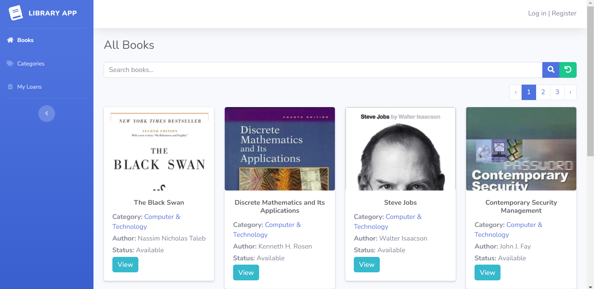

# **Library App**  
**Live Preview** - [Click Here](https://library-app-live-preview.com)

<br/>  
<div align="center">  
    
</div>  
<br/>  
<br/>

## 🛠 **Installation and Setup Instructions**

1. **Fork dan clone** repository ini. Pastikan Anda telah menginstal **NodeJs**, **Composer**, dan **Git** di mesin Anda.
   
2. Install dependensi:  
   ```bash  
   composer install && npm install
   
3. Di direktori proyek, jalankan:  
   ```bash  
   php artisan serve
   npm run dev
   
4. Migrasi database: 
   ```bash  
   php artisan migrate

5. Migrasi database: 
   ```bash  
   php artisan db:seed --class=RolePermissionSeeder  
   php artisan db:seed --class=UserSeeder


## 🚀 **Usage Instructions**

1. **Login ke halaman admin** menggunakan kredensial berikut:  
   - **Email**: `admin@example.com`  
   - **Password**: `password`

2. Setelah berhasil login, Anda dapat mengelola berbagai fitur dengan mudah melalui **dashboard admin**:  
   - **Buku**: Tambahkan, edit, atau hapus buku di perpustakaan.
   - **Kategori Buku**: Kelola kategori untuk mengorganisir buku dengan lebih baik.
  - **User**: Tambah, edit, hapus, dan kelola data pengguna.
   - **Peminjaman Buku**: Atur peminjaman buku oleh pengguna.

Semua fitur ini dapat diakses melalui dashboard yang **ramah pengguna** dan **mudah digunakan**.

---

## 🤝 **Contribute**

Pull Requests sangat diterima! Jika Anda memiliki ide atau ingin melakukan peningkatan untuk aplikasi ini, jangan ragu untuk mengirimkan. Kontribusi Anda sangat dihargai. 😊

---

## 📞 **Hubungi Saya**

Jika Anda memiliki pertanyaan atau umpan balik, silakan hubungi saya di **Instagram**: [@jouxing_ngo](https://instagram.com/jouxing_ngo).

---

## ⭐ **Show your support**

Jika Anda menyukai aplikasi ini, jangan lupa untuk memberikan **⭐**! Dukungan Anda sangat berarti bagi pengembangan proyek ini.

